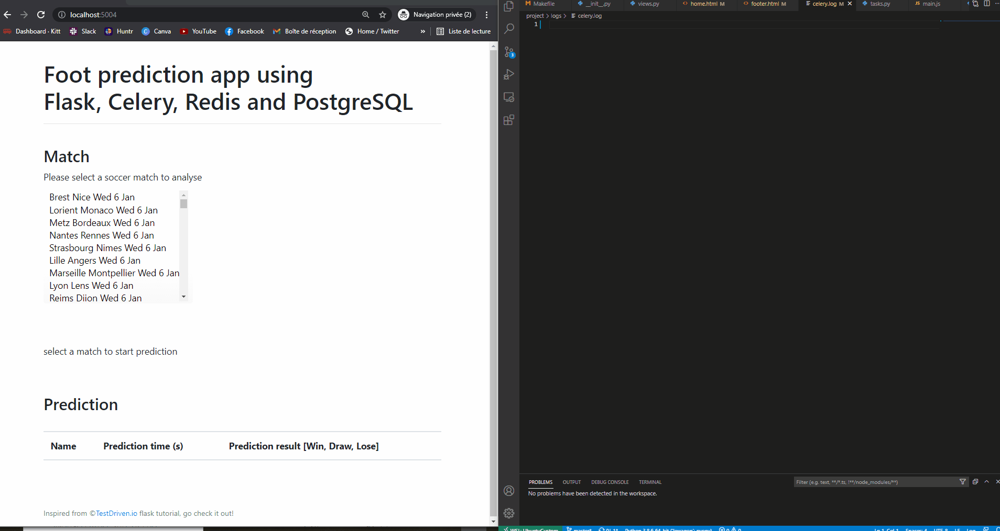

# Flask and Celery app to predict football matche outcome

Educatif project to manipulate background process.




## How it works

- Containerize Flask, Celery, Postgres, and Redis with Docker.
- Fill Postgres database with football datas (132 matches, 95 features)
- Run prediction in the background with a separate worker process, using a deep learning model.
- Return and display prediction
- Save Celery logs to a file


## Quick Start

Spin up the containers:

```sh
$ docker-compose up -d --build
```

Open your browser to [http://localhost:5004](http://localhost:5004)

:bomb:  As tensorflow is use to make prediction, the docker image is not very light...

## Bonus

Basic test and integration test, using mock for celery run method.